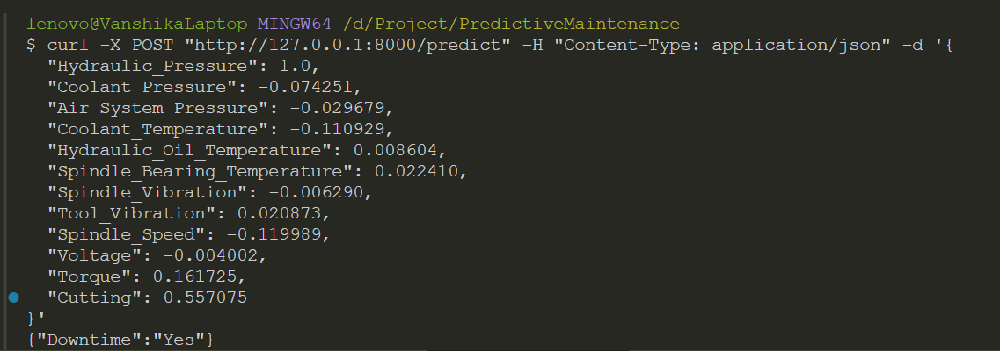

# Predictice Maitenance

# Setup

```python
pip install -r requirements.txt
uvicorn api:app --reload
```

# Example Use



# Methodology

This project aims to predict potential downtime using various machine learning techniques. The model uses a **Random Forest Classifier** for making predictions based on sensor data. This repository includes code for data preprocessing, feature extraction, model training, and deployment of the model as a REST API using **FastAPI**.

### Model Evaluation

The performance of the Random Forest Classifier model was evaluated using the following metrics:

- **Accuracy**: 1.0
- **Precision**: 1.0
- **Recall**: 1.0
- **F1-Score**: 1.0

These perfect scores indicate that the model is able to correctly predict downtime with no false positives or false negatives in the test data. This could suggest that the model is performing very well on the current dataset, but it's important to ensure the model generalizes well to unseen data and is not overfitting.
